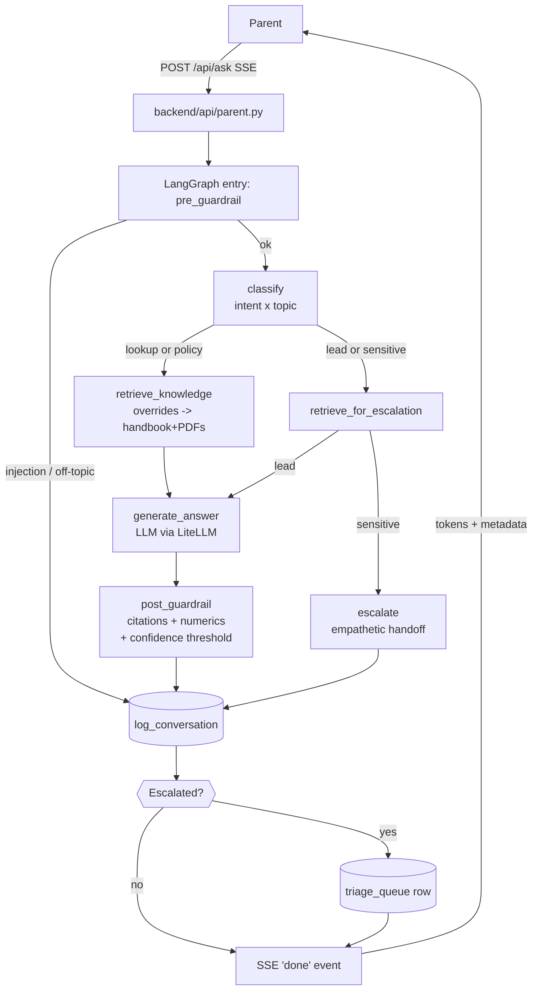
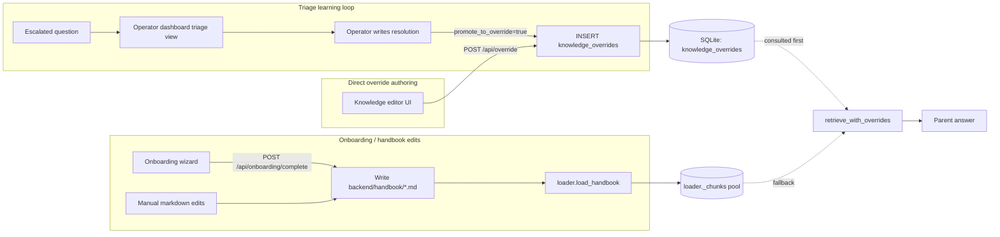
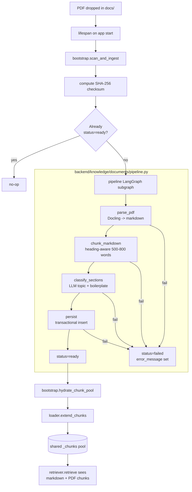

# AI Front Desk

**Intelligent chat assistant for daycare centers — a Brightwheel take-home prototype.**

AI Front Desk answers parents' questions about hours, tuition, policies, and meals using a center-specific handbook. When it can't answer confidently — or when a question is sensitive, revenue-critical, or outside scope — it escalates to the center's operator with full context preserved.

## Architecture

```
Parent Chat (React)  →  POST /api/ask (SSE)  →  LangGraph Orchestrator
                                                    ├─ Pre-call guardrails
                                                    ├─ Intent × Topic classifier
                                                    ├─ Knowledge retrieval (overrides → handbook)
                                                    ├─ Answer generation (per-intent)
                                                    ├─ Post-call guardrails (citations, numerics)
                                                    └─ Logging + triage queue

Operator Dashboard (React)  →  REST API  →  SQLite (conversations, triage, overrides)
```

**Stack:** Python 3.13, FastAPI, LangGraph, LiteLLM, SQLite, Vite + React + TypeScript + Tailwind CSS

## Flows

### 1. A parent chatting

The parent chat flow walks every question through the same LangGraph
orchestrator. Pre-call guardrails short-circuit prompt injection and off-topic
requests. The classifier assigns an intent (`lookup | policy | lead |
sensitive`) and topic. `lookup`/`policy` flow through retrieval → LLM answer →
post-call guardrails (citation + numeric verification). `lead`/`sensitive`
skip straight to escalation. Every turn — answered or escalated — is logged to
SQLite and streamed back over SSE.



### 2. An operator extending the knowledge base

Operators have three ways to grow the knowledge base, and all three funnel
into the same retrieval pool the parent chat reads. The triage learning loop
is the dominant path: when Maria resolves an escalated question, she can
promote her written answer into a `knowledge_override` with one click, and it
beats every other source on the next matching question.



### 3. How PDFs / custom documents get processed

Dropping a PDF into `docs/` triggers the ingestion subgraph on
the next app start. Docling parses to markdown, an LLM tags each section with
a topic from the closed vocabulary, and heading-aware chunks land in SQLite.
Startup then hydrates the same in-memory chunk pool the retriever uses, so
PDF-derived chunks are indistinguishable to downstream code. Identity is by
SHA-256 checksum, so re-runs are no-ops. Use the **Docs** tab on the operator
dashboard to list and delete ingested documents (removes both the SQLite rows
and the file on disk).



## Quick Start

### Docker (recommended)

```bash
cp .env.example .env
# Add your ANTHROPIC_API_KEY to .env
docker compose up --build
```

Open http://localhost:8000

### Local Development

```bash
# Backend
cd backend && pip install -e ".[dev]"
cd .. && uvicorn backend.main:app --reload --port 8000

# Frontend (separate terminal)
cd frontend && npm install && npm run dev
```

Frontend dev server runs on http://localhost:5173 with proxy to backend.

## Environment Variables

| Variable | Default | Description |
|----------|---------|-------------|
| `ANTHROPIC_API_KEY` | (required) | Anthropic API key for Claude |
| `DEFAULT_MODEL` | `anthropic/claude-sonnet-4-5` | Model for answer generation |
| `CLASSIFIER_MODEL` | `anthropic/claude-haiku-4-5` | Model for intent classification |
| `DATABASE_PATH` | `data/frontdesk.db` | SQLite database location |
| `HANDBOOK_PATH` | `backend/handbook` | Path to handbook markdown files |
| `DOCUMENTS_PATH` | `docs` | Path to shipped PDF handbooks (auto-ingested at startup) |
| `CENTER_NAME` | `Sunrise Early Learning` | Center name shown in UI |
| `OPERATOR_EMAIL` | `maria@sunrise-daycare.example` | Operator email for escalations |
| `CONFIDENCE_THRESHOLD_LOOKUP` | `0.75` | Min confidence for lookup answers |
| `CONFIDENCE_THRESHOLD_POLICY` | `0.65` | Min confidence for policy answers |
| `LANGSMITH_API_KEY` | (optional) | Enables LangSmith tracing |

## Pages

- **`/`** — Parent chat interface (mobile-first)
- **`/operator`** — Operator dashboard (triage queue, conversations, knowledge editor, insights)
- **`/onboarding`** — Center setup wizard

## How It Works

### Intent × Topic Classification

Every parent question is classified on two dimensions:

- **Intent** (`lookup | policy | lead | sensitive`) determines *how* the system handles it
- **Topic** (`hours | tuition | sick_policy | meals | tours | ...`) determines *what* it's about

Different intents have different confidence thresholds and behaviors:

| Intent | Behavior |
|--------|----------|
| **Lookup** | Answer from handbook with citation. High confidence bar. |
| **Policy** | Conservative answer + "I've flagged this for staff." |
| **Lead** | Capture parent info, priority-escalate to operator. |
| **Sensitive** | Never answer. Escalate with context preserved. |

### Knowledge Layers

Checked in order:
1. **Operator overrides** — answers Maria has explicitly provided (always wins)
2. **Center handbook** — markdown files in `backend/handbook/` plus any PDFs
   dropped into `docs/` (auto-ingested at startup via the
   document pipeline: Docling parser → LLM topic classifier → heading-aware
   chunker → SQLite; merged into the same retrieval pool as the markdown)
3. **Generic knowledge** — baseline answers in `backend/handbook/_generic/`

Docling is an optional extra. Install with `pip install -e ".[documents]"`
when you want to ingest PDFs; the core install skips the ~2GB torch/easyocr
dependency chain so CI and dev stay fast.

### Guardrails

- **Pre-call:** Block prompt injection, detect sensitive keywords, filter off-topic
- **In-call:** Pydantic-validated structured outputs, "do not infer" instructions
- **Post-call:** Citation verification, numeric sanity check (no hallucinated dollar amounts)

### Learning Loop

When the operator resolves a triage item, they can promote their answer to a knowledge override with one click. That override is checked first on all future queries — the system gets smarter every time the operator answers a question.

## Testing

```bash
# Start the server, then:
python -m backend.tests.run_evals
```

Runs 16 test questions against the API and validates intent classification, topic tagging, escalation behavior, citations, and guardrails.

## Project Structure

```
├── backend/
│   ├── main.py              # FastAPI app
│   ├── settings.py           # pydantic-settings config
│   ├── api/                  # Route handlers
│   │   ├── parent.py         # POST /api/ask (SSE)
│   │   ├── operator.py       # Triage, overrides, stats
│   │   └── onboarding.py     # Center setup
│   ├── graph/                # LangGraph orchestration
│   │   ├── graph.py          # Graph assembly
│   │   ├── state.py          # State definition
│   │   └── nodes/            # Pre-guardrail, classify, retrieve, answer, escalate, post-guardrail
│   ├── knowledge/            # Retrieval layer
│   │   ├── loader.py         # Markdown → chunks
│   │   ├── retriever.py      # Keyword retriever (v1)
│   │   └── overrides.py      # Override-first retrieval
│   ├── db/                   # SQLite DAL
│   ├── prompts/              # LLM prompt templates
│   ├── handbook/             # Center-specific handbook (pre-filled for Sunrise)
│   └── tests/                # Eval suite
├── frontend/
│   └── src/
│       ├── pages/            # ParentChat, OperatorDashboard, Onboarding
│       ├── components/       # ChatMessage, TriageQueue, KnowledgeEditor, TopicCluster
│       └── lib/              # API client, SSE helper
├── Dockerfile                # Multi-stage build
├── docker-compose.yml
└── Makefile
```
# chatdemo
